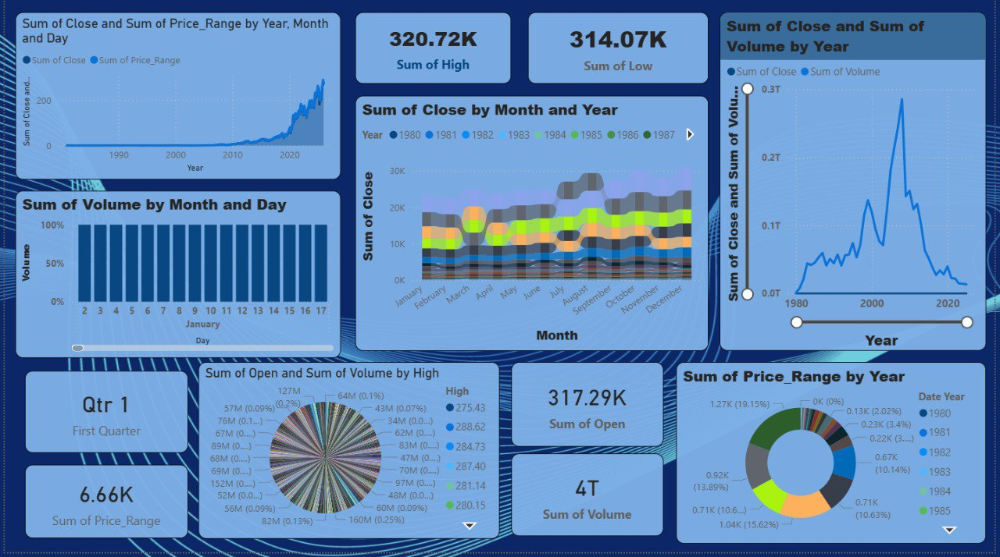

# AAPL Stock Price Analysis Dashboard 📊
An interactive Power BI dashboard built using an AAPL stock price dataset sourced from Kaggle to analyze trends and visualize market data.
## Project Overview
This project focuses on cleaning stock market data and transforming it into meaningful visual insights using Power BI.
### Key Insights Explored
- Stock price trends over time
- Trading volume patterns
- High vs Low price movements
- KPI-driven visual insights
## Tools Used
- Power BI
- Data Cleaning
- Data Visualization
## Dashboard Preview
.
## Project Walkthrough Video
Watch the demo here: https://www.linkedin.com/posts/disha-ghosh-b2a272293_powerbi-dataanalytics-datavisualization-activity-7455290433905057792-VaYB?utm_source=share&utm_medium=member_desktop&rcm=ACoAAEcNUtIBmPd2Cus88VHquKAEDs5tHQjCN00

## Dataset Source
Dataset sourced from Kaggle.

## Skills Demonstrated
- Data Analysis  
- Dashboard Development  
- KPI Reporting  
- Data Cleaning  
- Data Visualization

## Author
Disha Ghosh
